# Mermaid Diagramming in Obsidian

Obsidian has built-in Mermaid support. Use fenced code blocks with `mermaid` language identifier.

For common syntax (styling, comments, themes), see [reference.md](reference.md).

## ⚠️ Obsidian-Specific Constraints

**Rendering Differences**: Obsidian's Mermaid version may lag behind mermaid.js releases. Some cutting-edge features may not work.

**Theme Interaction**: Diagram colors adapt to Obsidian theme. Use explicit styles for consistent appearance across themes.

**Performance**: Very large diagrams (50+ nodes) may slow down rendering. Split into multiple diagrams if needed.

**Export**: PDF export converts diagrams to images. For external sharing, capture as PNG/SVG.

**No JavaScript**: Click events and JavaScript callbacks are disabled for security.

---

## Diagram Selection Guide

| Use Case | Diagram Type | Keyword |
|----------|--------------|---------|
| Process flow, decision trees | Flowchart | `flowchart` |
| API calls, message passing | Sequence | `sequenceDiagram` |
| OOP design, relationships | Class | `classDiagram` |
| Project timeline, scheduling | Gantt | `gantt` |
| State machine, lifecycle | State | `stateDiagram-v2` |
| Git branching strategy | Gitgraph | `gitGraph` |
| Brainstorming, hierarchies | Mindmap | `mindmap` |
| Proportions, percentages | Pie Chart | `pie` |

---

## Quick Start Examples

### Flowchart

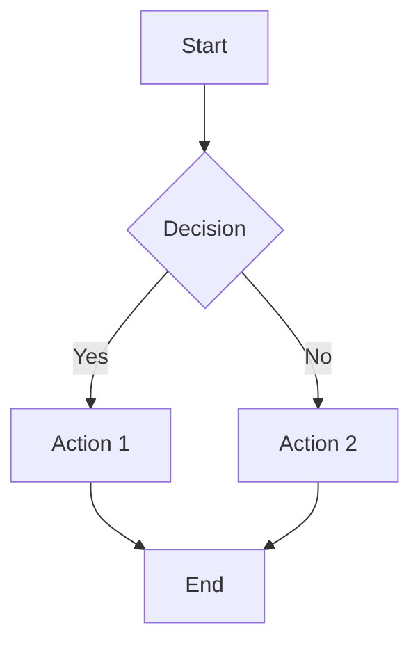

**Key syntax:**
- Direction: `TD` (top-down), `LR` (left-right), `BT`, `RL`
- Shapes: `[rect]`, `(rounded)`, `{diamond}`, `[(cylinder)]`, `((circle))`
- Arrows: `-->`, `-.->` (dotted), `==>` (thick)
- Labels: `-->|text|` or `-- text -->`

For details: [flowchart.md](flowchart.md)

---

### Sequence Diagram

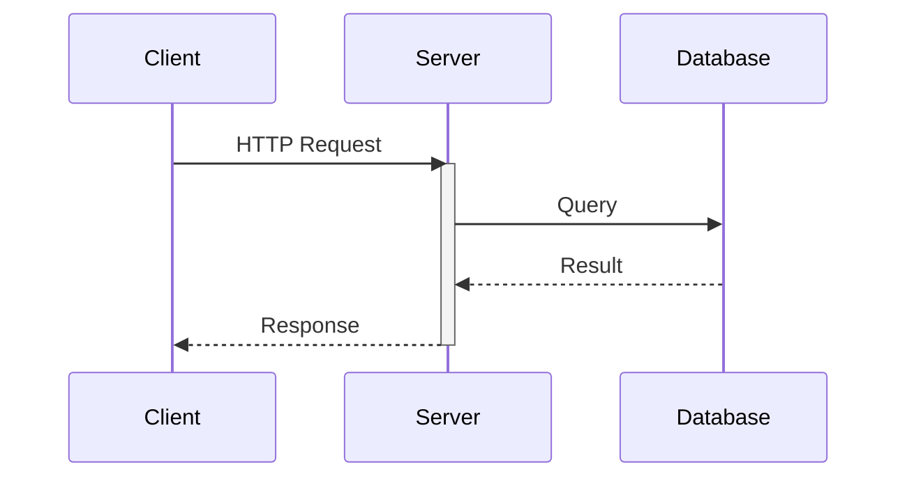

**Key syntax:**
- Arrows: `->>` (sync), `-->>` (response), `-)` (async)
- Activation: `activate`/`deactivate` or `+`/`-` suffix
- Control: `loop`, `alt`/`else`, `opt`, `par`/`and`, `critical`
- Notes: `Note right of A: text`, `Note over A,B: text`

For details: [sequence.md](sequence.md)

---

### Class Diagram

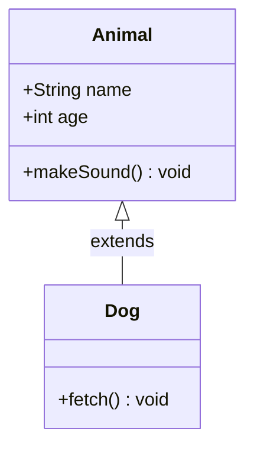

**Key syntax:**
- Visibility: `+` public, `-` private, `#` protected, `~` package
- Relations: `<|--` inheritance, `*--` composition, `o--` aggregation, `-->` association
- Methods: `+method(args) returnType`

For details: [class-diagram.md](class-diagram.md)

---

### Gantt Chart

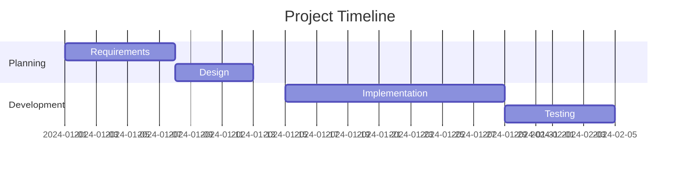

**Key syntax:**
- `dateFormat`: Date format (YYYY-MM-DD, etc.)
- Tasks: `name :id, start, duration` or `name :after id, duration`
- Modifiers: `done`, `active`, `crit`, `milestone`

For details: [gantt.md](gantt.md)

---

### State Diagram

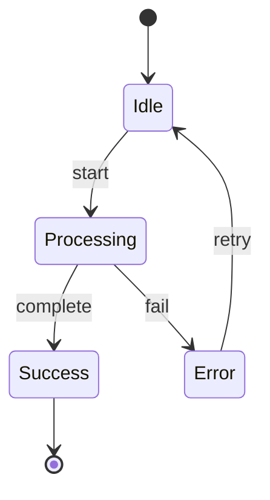

**Key syntax:**
- Start/End: `[*]`
- Transition: `State1 --> State2 : event`
- Composite: `state Name { ... }`
- Fork/Join: `state fork_name <<fork>>`, `<<join>>`

For details: [state.md](state.md)

---

### Gitgraph

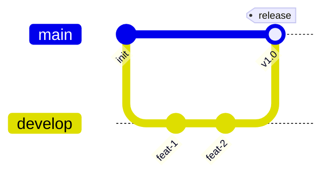

**Key syntax:**
- `commit`: Add commit, optional `id:`, `tag:`, `type:`
- `branch name`: Create branch
- `checkout name`: Switch branch
- `merge name`: Merge branch

For details: [gitgraph.md](gitgraph.md)

---

### Mindmap

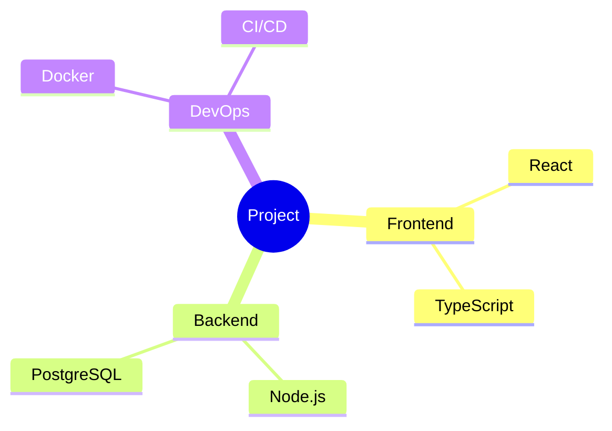

**Key syntax:**
- Indentation defines hierarchy
- Shapes: `root((circle))`, `(rounded)`, `[square]`, `))cloud((`
- Use 4-space or tab indentation

For details: [mindmap.md](mindmap.md)

---

### Pie Chart

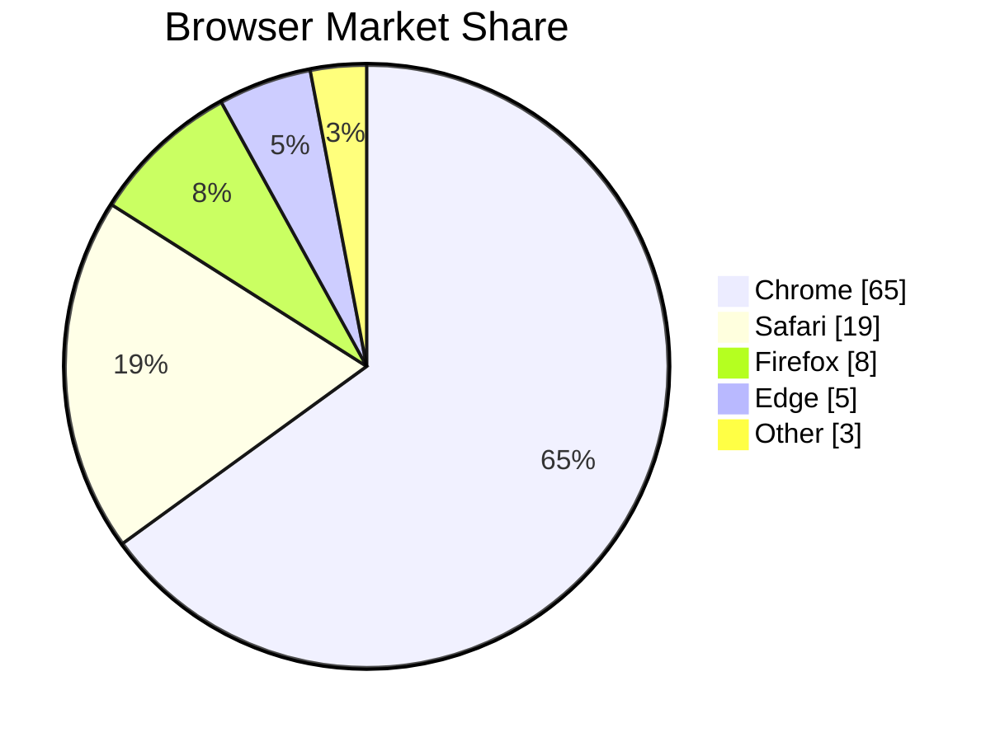

**Key syntax:**
- `title`: Optional chart title
- `showData`: Display values on segments
- Format: `"Label" : value`

For details: [pie.md](pie.md)

---

## Common Patterns

### Adding Styles

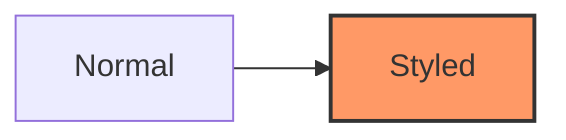

### Using Classes

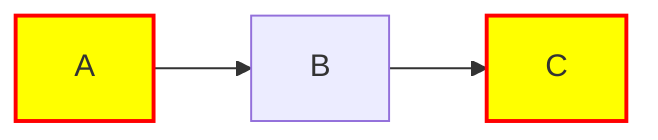

### Comments

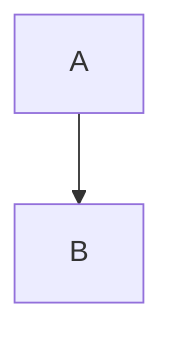

---

## Reference

For complete documentation on common features:
- [reference.md](reference.md) - Styling, themes, comments, directives

For diagram-specific guides (Session 2-4):
- [flowchart.md](flowchart.md) - Node shapes, links, subgraphs
- [sequence.md](sequence.md) - Messages, activation, control flow
- [class-diagram.md](class-diagram.md) - Classes, relationships
- [gantt.md](gantt.md) - Tasks, dependencies, milestones
- [state.md](state.md) - States, transitions, composite states
- [gitgraph.md](gitgraph.md) - Commits, branches, merges
- [mindmap.md](mindmap.md) - Hierarchies, node shapes
- [pie.md](pie.md) - Proportional data
