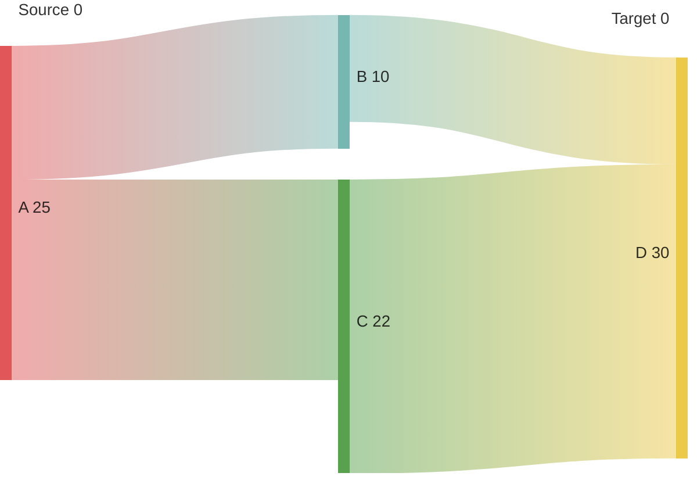
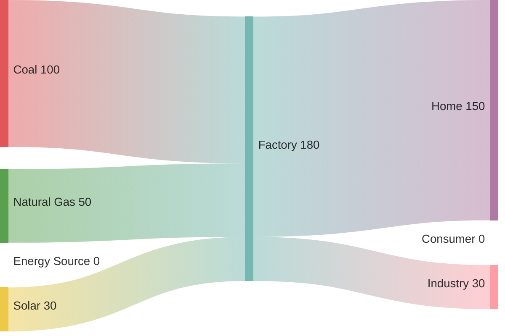
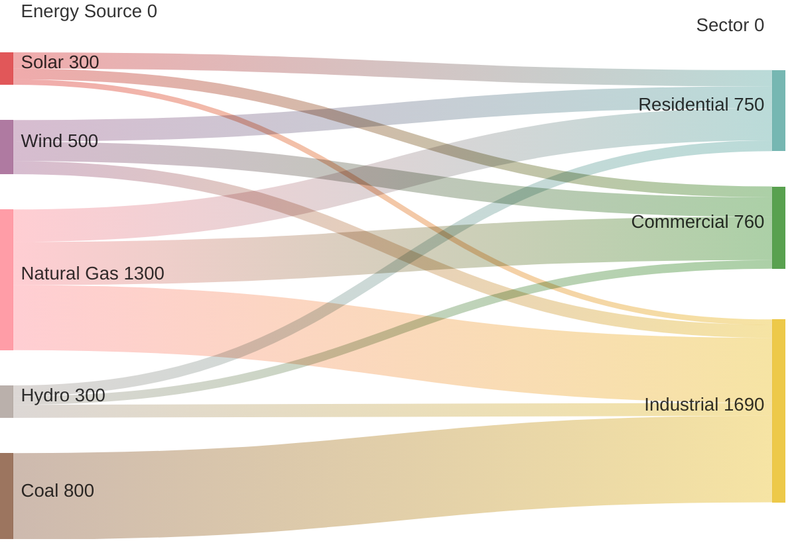
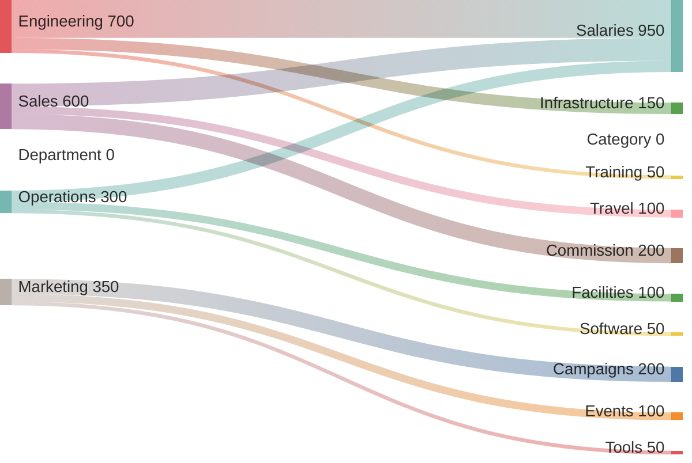
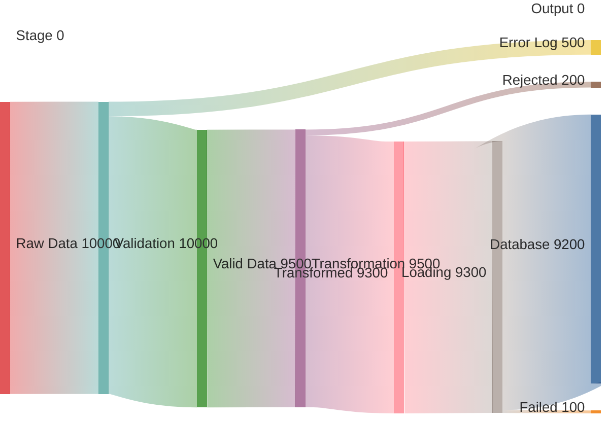
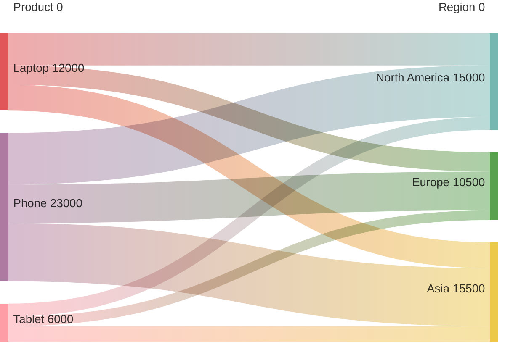
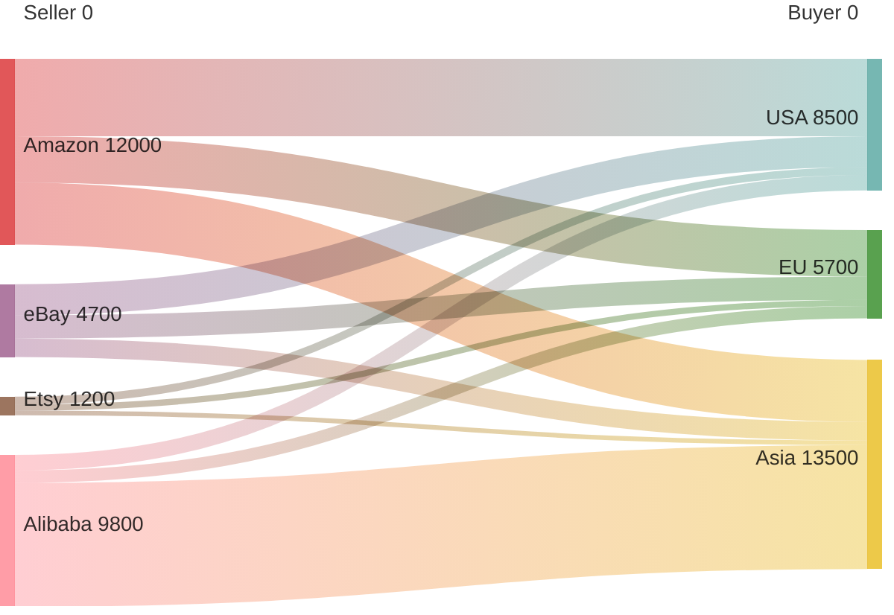
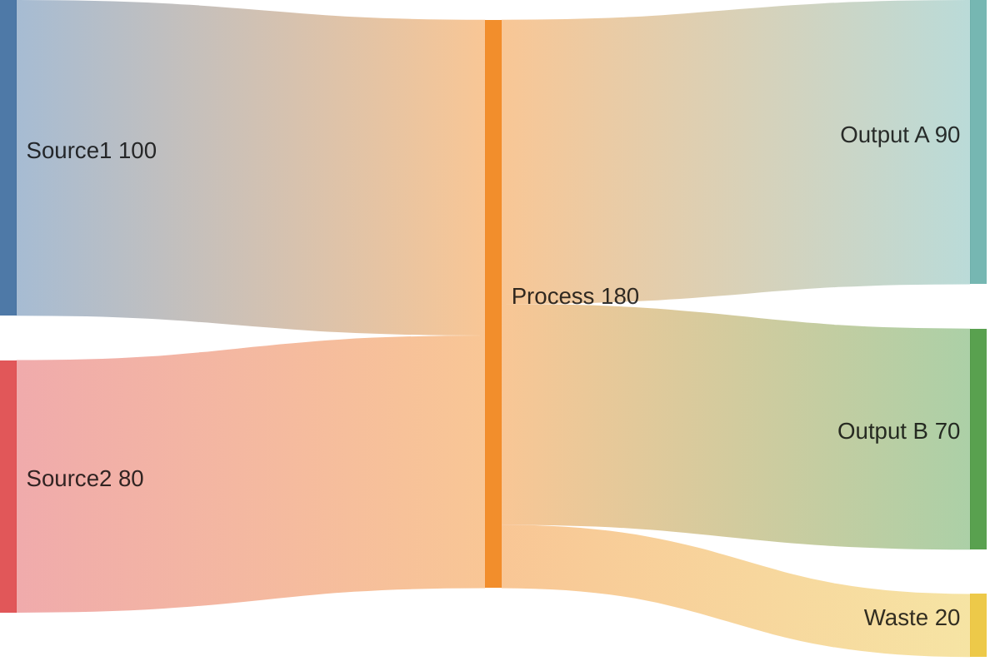
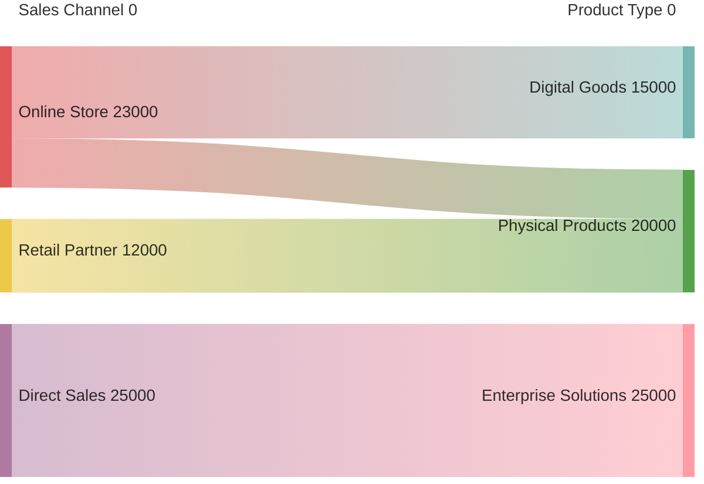
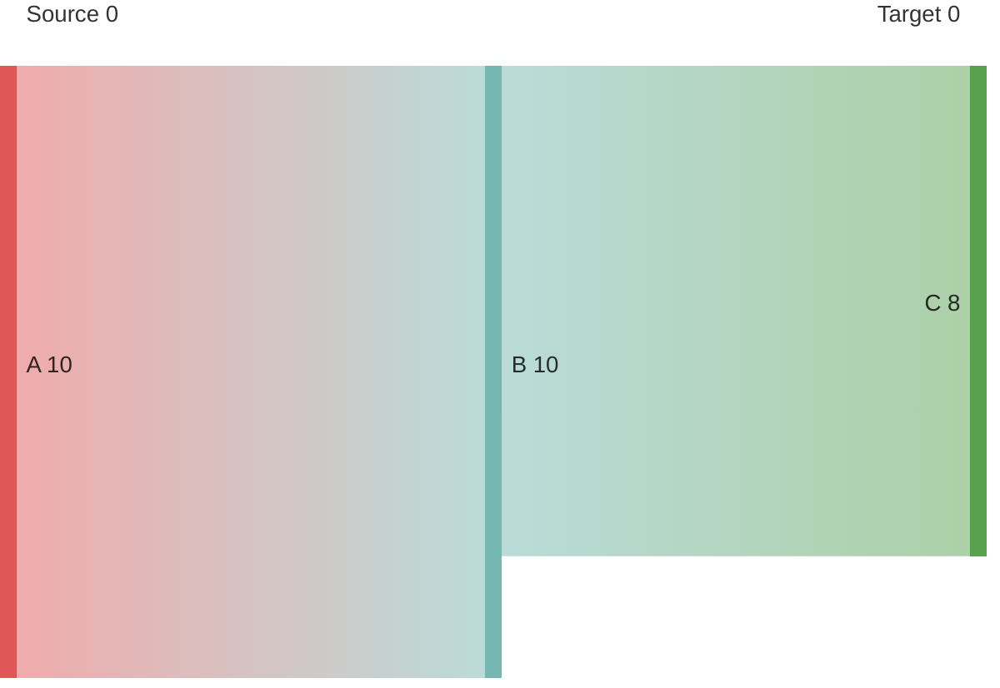

# Sankey Diagram Reference

Complete guide for Mermaid Sankey diagrams in Obsidian.

---

## Overview

A Sankey diagram visualizes flows between connected elements using proportional bands. The width of each band represents the magnitude of the flow, making it ideal for showing distribution, allocation, and transformation of quantities.

---

## Basic Syntax

Sankey diagrams use CSV format with three columns: **source**, **target**, and **value**.

### Simple Example



### CSV Format Rules

| Rule | Example |
|------|---------|
| Three columns required | `source, target, value` |
| Values must be numeric | `10`, `42`, `100.5` |
| Empty lines allowed | Blank lines for organization |
| Commas in names | Use double quotes: `"New York"` |
| Case sensitive | `A` and `a` are different nodes |

---

## Node Concepts

### Automatic Node Creation

Nodes are automatically created from source and target values:



### Node Order

Nodes appear in the order they are first mentioned in the data.

---

## Configuration

### Link Color Strategy

Control how flows are colored:

**Source Color** (inherits from source node):
```mermaid
sankey
    %%{init: {'sankey': {'linkColor': 'source'}}}%%
Source,Target,Value
A,X,10
B,X,5
C,Y,8
```

**Target Color** (inherits from target node):
```mermaid
sankey
    %%{init: {'sankey': {'linkColor': 'target'}}}%%
Source,Target,Value
A,X,10
B,X,5
C,Y,8
```

**Gradient Color** (smooth transition):
```mermaid
sankey
    %%{init: {'sankey': {'linkColor': 'gradient'}}}%%
Source,Target,Value
A,X,10
B,Y,5
```

**Custom Hex Color**:
```mermaid
sankey
    %%{init: {'sankey': {'linkColor': '#a1a1a1'}}}%%
Source,Target,Value
A,B,10
B,C,8
```

### Node Alignment

Configure node positioning:

```mermaid
sankey
    %%{init: {'sankey': {'nodeAlignment': 'center'}}}%%
Source,Target,Value
A,B,10
```

| Alignment | Behavior |
|-----------|----------|
| `justify` | Spread nodes across height |
| `center` | Center nodes vertically |
| `left` | Align to left side |
| `right` | Align to right side |

---

## Practical Examples

### Example 1: Website Traffic Flow

```mermaid
sankey

Source,Target,Visitors
Google,Homepage,1200
Direct,Homepage,800
Facebook,Homepage,450
Homepage,Product Page,1500
Homepage,Blog,500
Homepage,Pricing,250
Product Page,Cart,600
Product Page,Homepage,400
Blog,Homepage,200
Cart,Checkout,450
```

### Example 2: Energy Distribution



### Example 3: Budget Allocation



### Example 4: Data Pipeline Flow



### Example 5: Software Development Workflow

```mermaid
sankey

Source,Destination,Count
Backlog,In Development,15
In Development,Testing,12
Testing,Deployment,10
Testing,Fix Required,2
Fix Required,Testing,2
Deployment,Production,10
Production,Monitoring,10
Backlog,Documentation,3
```

---

## Data Preparation Tips

### Handling Large Values

Use consistent units and scale for clarity:



### Multi-Level Flows

Create hierarchical flows:


### Balanced Flows

Ensure upstream equals downstream:


---

## Advanced Features

### Large Datasets

Sankey handles many nodes and flows efficiently:



### Comments

Add comments for organization:



### Special Characters in Names

Use quotes for names with spaces or special characters:



---

## Obsidian Notes

**Theme Compatibility**: Sankey link colors adapt to Obsidian theme. Use `linkColor: '#hex'` for consistent appearance across themes.

**Performance**: Sankey diagrams handle 50+ nodes smoothly. Very large datasets (200+ flows) may require horizontal scrolling.

**Export**: PDF export renders Sankey diagrams as images. For external sharing, capture as PNG/SVG.

**Node Ordering**: Nodes appear in the order they first appear in the CSV. Reorganize rows to change layout if needed.

**Value Units**: The value column represents flow quantity—units are arbitrary (can be dollars, units, people, etc.).

**Code Block Format**:
````

````

---

## Quick Reference Table

| Concept | Syntax | Example |
|---------|--------|---------|
| Chart type | `sankey` | Start diagram |
| CSV format | `source,target,value` | `A,B,10` |
| Node name | Text value | `Sales Channel` |
| Flow value | Number | `1500` |
| Names with spaces | Quoted | `"New York"` |
| Link color (source) | `'linkColor': 'source'` | Color from source |
| Link color (target) | `'linkColor': 'target'` | Color from target |
| Link color (gradient) | `'linkColor': 'gradient'` | Smooth transition |
| Link color (hex) | `'linkColor': '#a1a1a1'` | Custom color |
| Node alignment | `'nodeAlignment': 'center'` | Center positioning |
| Comments | `%%` | `%% note` |
| Empty lines | Allowed | Visual organization |
